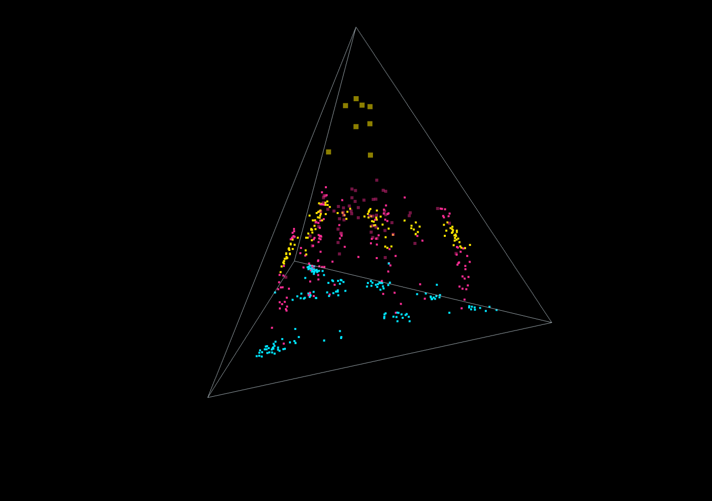
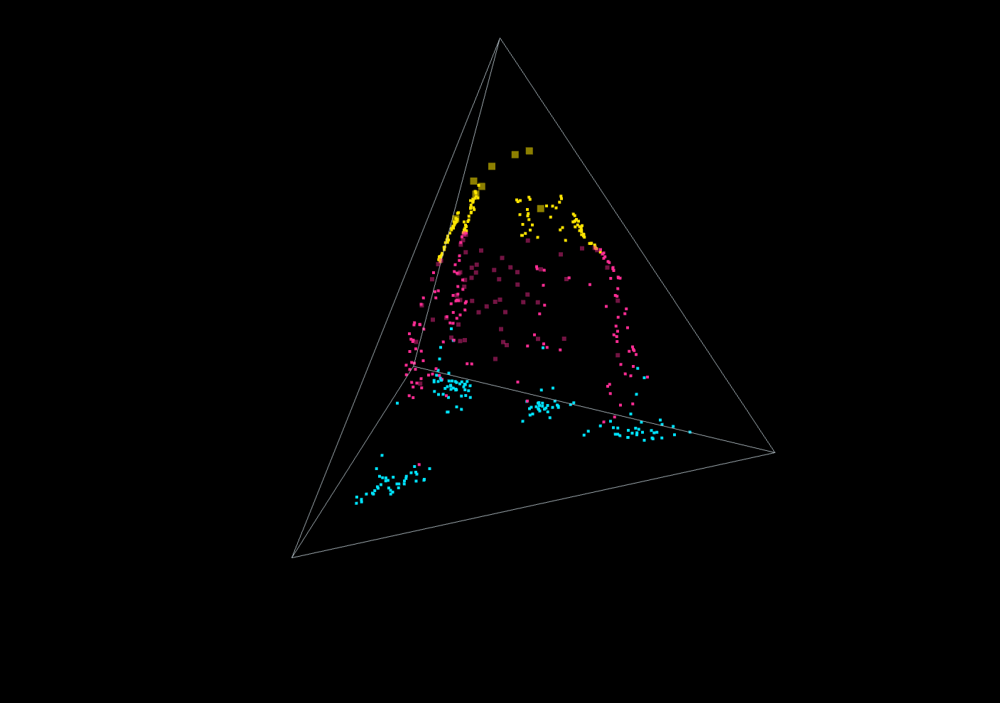

# Tetrahedral Memory Field

Tetrahedral Memory Field is a browser-based, deterministic 3D visualization of a tiered memory-like dynamical system inside a simplex-bounded tetrahedral volume. It renders a live point cloud where nodes consolidate across tiers while a pre-clamp out-of-bounds (OOB) signal is monitored.

Live demo: https://putmanmodel.github.io/tetrahedral-memory-field-demo/

## Related paper

- Zenodo DOI: `10.5281/zenodo.18701137`  
  Link: `https://doi.org/10.5281/zenodo.18701137`

## Quickstart

```bash
# from the project root
python3 -m http.server 5173 --bind 127.0.0.1
```

Open `http://127.0.0.1:5173/`.

## What It Does

The simulation maintains three tiers:

- `tier 0` short-term nodes: fast-moving, low-persistence nodes
- `tier 1` consolidated nodes: more stable nodes attracted toward intermediate anchors
- `tier 2` structural priors: the most stable nodes, biased toward structural anchors

All movement is constrained to a tetrahedral volume using barycentric coordinates. When nodes attempt to leave the simplex, the simulation computes an OOB violation mass (`V`) before clamping them back inside. That pre-clamp signal drives:

- soft and hard OOB event counters
- rolling one-second OOB summaries
- visual flashing and optional status logging

## Main Features

- Deterministic seeded behavior (`seed = 1337`) for repeatable demos
- Live 3D rendering with orbit controls
- Parameter sliders for consolidation and motion tuning
- Presets for different memory and breach behaviors
- OOB monitoring with hysteresis and cooldown anti-chatter logic
- Export to PNG (canvas snapshot)

## Screenshots

### Soft Breach (calm monitor)


### Hard Break (HARD episodes)


Use **Export PNG** to generate consistent images for documentation.

## Presets

The UI includes these preset profiles:

- `Balanced (default)`: neutral baseline
- `Fast Consolidation`: aggressive consolidation and quicker tier promotion
- `Sticky Memory (high viscosity)`: slower movement and stickier higher tiers
- `Reluctant Priors (hard thresholds)`: higher thresholds for consolidation
- `Soft Breach (calm monitor)`: low-rate, mostly soft OOB behavior
- `Hard Break (HARD episodes)`: clearer hard breach episodes with moderate event density

Presets apply immediately when selected. Use `Re-apply preset` to reset + re-load the current preset.

Applying a preset:

- resets the simulation state
- applies the preset parameters
- updates slider positions to match
- pauses playback so the new preset can be inspected before running

## Controls

### Core Controls

- `Play / Pause`: starts or pauses the simulation loop
- `Reset`: restores the seeded layout and default preset
- `Reset View`: re-centers the camera
- `Export PNG`: saves the current frame

### Export

- `Export PNG`: saves a canvas snapshot of the current view

### Scene Controls

- `Show hull`: toggles the faint tetrahedral surface
- `Auto-center camera`: gently recenters the orbit target while the simulation runs

### Diagnostics

- `Log SOFT`: when enabled, SOFT OOB events are written to the status log
- `HARD` events always log

## OOB Monitor Readout

The OOB summary line reports:

- soft event count
- hard event count
- `peak V (last 1s)`
- `peak severity (last 1s)`
- `breached nodes (last 1s)`
- current hysteresis thresholds for entering and exiting soft/hard breach states

When paused, the UI intentionally keeps the last meaningful one-second OOB snapshot visible so the readout does not drop to zero immediately.

## How To Run

This project is static HTML/JS (no build step).

### Serve locally (recommended)

```bash
python3 -m http.server 5173 --bind 127.0.0.1
```

Open `http://127.0.0.1:5173/`.

If you prefer a different server:

```bash
python3 -m http.server 8000
# or
npx serve .
```

## Project Structure

- `index.html`: UI shell, layout, controls, inline styles
- `src/main.js`: app wiring, rendering, UI events, presets, export flow
- `src/sim.js`: simulation model, tier evolution, OOB detection, anchors, motion constraints
- `src/random.js`: deterministic RNG
- `vendor/three.module.js`: bundled Three.js module
- `vendor/OrbitControls.js`: orbit camera controls

## Tuning Notes

- Lower `maxStep` and higher `damping` generally make behavior calmer and more monitor-like.
- Lower `viscosity_u` / `viscosity_a` increases motion and can create more consolidation pressure.
- Lower `threshold_mu` / `threshold_ua` makes tier transitions easier.
- `clampStrength` affects how aggressively nodes are pulled back into the tetrahedron after a breach attempt.

If you are tuning for clearer monitoring behavior:

- use `Soft Breach (calm monitor)` to look for rare, mild events
- use `Hard Break (HARD episodes)` to surface sharper break episodes without constant chatter

## Intended Use

This repository is a visualization and exploration tool. It is best suited for:

- demos
- concept illustration
- interaction design experiments
- visual monitoring metaphors

It is not presented as a scientific model of human cognition.

## Author / Contact

**Stephen Putman** (PUTMAN)

- GitHub: `https://github.com/putmanmodel`
- Email: `putmanmodel@pm.me`
- BlueSky: `@putmanmodel.bsky.social`
- X / Twitter: `@putmanmodel`
- Reddit: `u/putmanmodel`

## License

This project is licensed under the Creative Commons Attribution-NonCommercial 4.0 International license (`CC BY-NC 4.0`).

See `LICENSE` for details.
